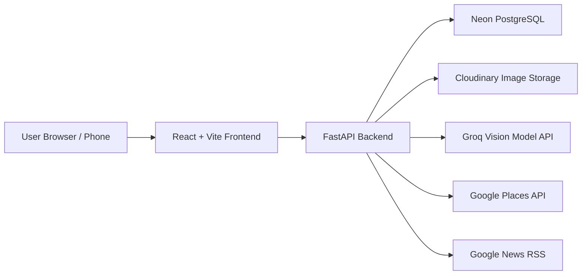
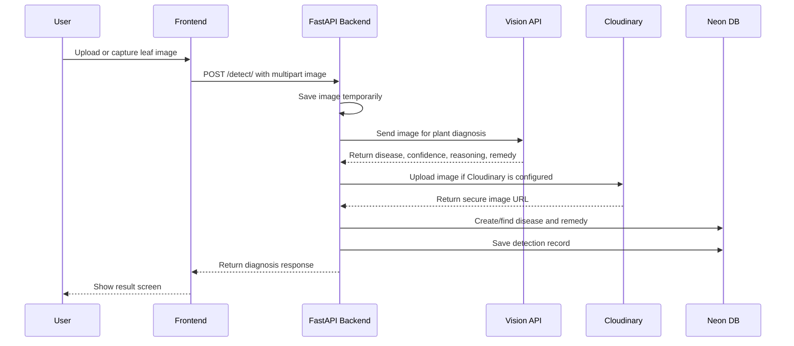
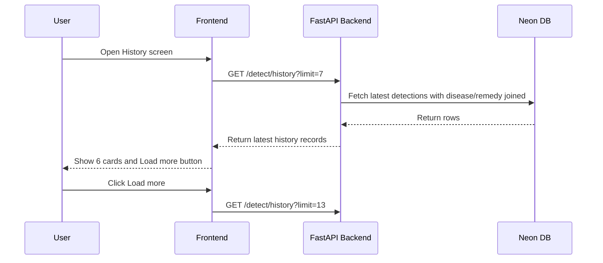
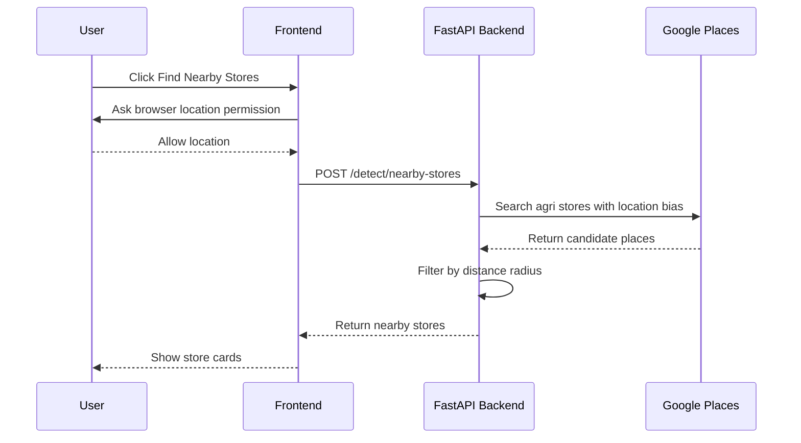
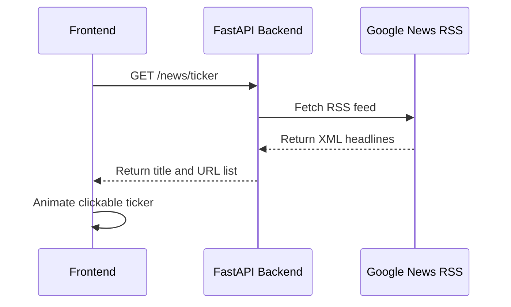
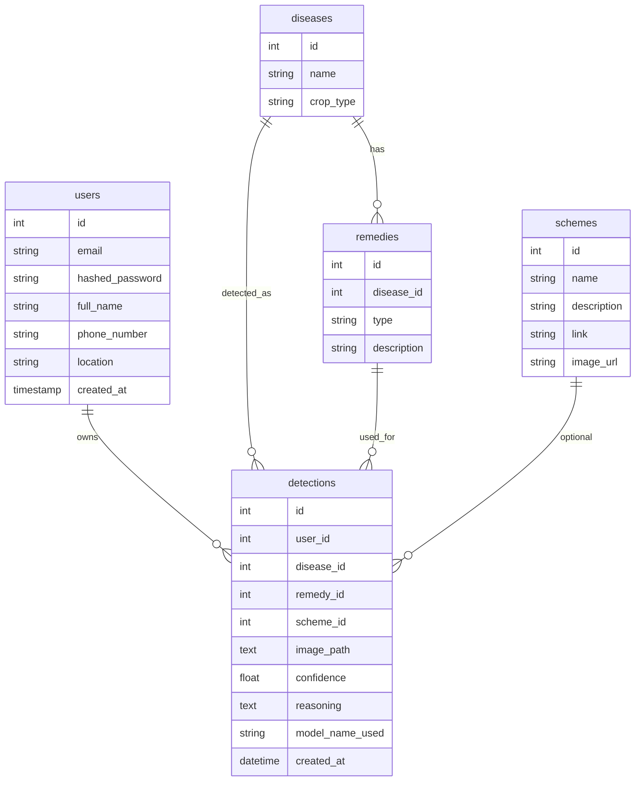
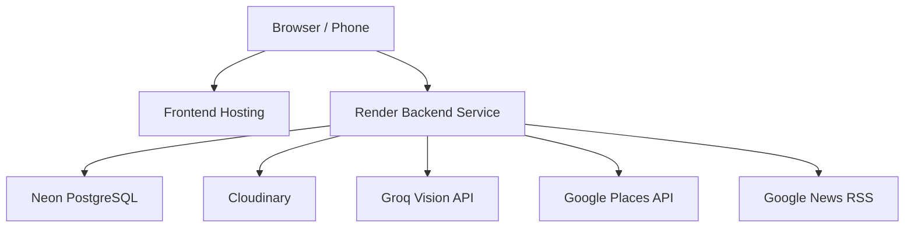

# CropCare System Architecture

CropCare is an end-to-end plant disease diagnosis product. A user uploads or captures a leaf image, the backend analyzes it, stores the result, and the frontend presents diagnosis, remedy, history, nearby agri-store support, and agriculture news.

## High-Level Architecture

## Main Components

### Frontend

Location: `frontend/`

Technology:

- React
- Vite
- TypeScript
- Tailwind CSS
- Axios

Responsibilities:

- Show home, diagnosis result, history, and profile screens.
- Capture images from phone or laptop camera.
- Upload images to the backend.
- Display diagnosis result, confidence, remedy, and AI reasoning.
- Display scan history with incremental loading.
- Show nearby agri stores.
- Show a scrolling news ticker under the navbar.

Important files:

- `frontend/src/App.tsx`
- `frontend/src/api.ts`
- `frontend/src/screens/HomeScreen.tsx`
- `frontend/src/screens/ResultsScreen.tsx`
- `frontend/src/screens/HistoryScreen.tsx`
- `frontend/src/components/CameraCaptureModal.tsx`
- `frontend/src/components/NewsTicker.tsx`

### Backend

Location: `backend/`

Technology:

- FastAPI
- SQLAlchemy
- Alembic
- Pydantic
- HTTPX

Responsibilities:

- Receive uploaded leaf images.
- Call the AI vision model.
- Upload images to Cloudinary when configured.
- Save diagnosis records in Neon PostgreSQL.
- Serve scan history.
- Serve nearby agri-store search.
- Serve news ticker headlines.
- Provide auth and user routes.

Important files:

- `backend/app/main.py`
- `backend/app/routers/detect.py`
- `backend/app/routers/news.py`
- `backend/app/routers/health.py`
- `backend/app/ai_model.py`
- `backend/app/cloudinary_service.py`
- `backend/app/nearby_stores_service.py`
- `backend/app/models.py`
- `backend/app/schemas.py`
- `backend/app/database.py`
- `backend/app/config.py`

### Database

Service: Neon PostgreSQL

Responsibilities:

- Store users.
- Store diseases.
- Store remedies.
- Store government schemes.
- Store detection history.
- Store image URLs or local image paths, not raw image files.

Main tables:

- `users`
- `detections`
- `diseases`
- `remedies`
- `schemes`

Images are stored in Cloudinary or `backend/uploaded_images/`, while the database stores only the image path or URL.

### Image Storage

Service: Cloudinary

Responsibilities:

- Store uploaded scan images in production.
- Return a stable image URL for frontend display and history.

If Cloudinary is not configured, the backend stores uploaded images locally under `backend/uploaded_images/`.

### AI Diagnosis

Service: Groq-compatible vision API

Responsibilities:

- Analyze uploaded leaf images.
- Return crop type, disease name, confidence, reasoning, and remedy.

If `MODEL_API_KEY` is missing, the backend returns a fallback placeholder diagnosis. This is useful for development but should not be used as the final production behavior.

### Nearby Agri Stores

Service: Google Places API

Responsibilities:

- Search for nearby agriculture stores, fertilizer shops, pesticide suppliers, seed shops, nurseries, and plant care suppliers.

Current behavior:

- The frontend asks the browser for location.
- The backend calls Google Places Text Search.
- The backend filters results by distance using the configured radius.
- Results are sorted nearest first.

### News Ticker

Source: Google News RSS

Responsibilities:

- Provide lightweight agriculture and plant disease headlines.
- Return fallback headlines if RSS fetching fails.
- Make ticker headlines clickable.

## End-to-End Diagnosis Flow

## History Flow

The frontend requests one extra record to decide whether a Load more button should be shown.

## Nearby Store Flow

## News Ticker Flow

If RSS fails, the backend returns fallback headlines.

## Data Model Summary

## API Surface

Core endpoints:

- `GET /`
- `POST /users/signup`
- `POST /login`
- `POST /detect/`
- `GET /detect/history?limit=20`
- `POST /detect/nearby-stores`
- `GET /news/ticker`
- `GET /health/config`
- `GET /schemes/`
- `POST /schemes/`
- `POST /diseases/`
- `POST /diseases/{disease_id}/remedy`

## Deployment Architecture

Frontend deployment needs:

- `VITE_API_URL`

Backend deployment needs:

- `DATABASE_URL`
- `SECRET_KEY`
- `FRONTEND_URL` or `FRONTEND_URLS`
- `MODEL_API_KEY`
- `MODEL_NAME`
- `MODEL_API_URL`
- `CLOUDINARY_API_KEY`
- `CLOUDINARY_SECRET_KEY`
- `CLOUDINARY_CLOUD_NAME`
- `CLOUDINARY_UPLOAD_PRESET`
- `GOOGLE_MAPS_API_KEY`
- `GOOGLE_PLACES_SEARCH_RADIUS_METERS`
- `NEWS_RSS_URL`

## Current Strengths

- Clear separation between frontend, backend, ML code, database, and storage.
- Production-friendly image storage through Cloudinary.
- Neon stores structured records rather than large image files.
- Backend has migrations through Alembic.
- History loading is limited and indexed.
- Nearby store search is optional and does not block diagnosis.
- News ticker has a safe fallback.

## Current Gaps

- The deployed diagnosis currently depends on an external vision API instead of the local trained ML model.
- Auth exists, but detection history is not yet tied to the logged-in user in the frontend flow.
- The `ml/` training code is not connected to backend inference.
- Root documentation and ML paths should stay aligned with the actual app.
- The mobile app folder appears experimental and should be cleaned or documented separately.

## Recommended Next Steps

1. Connect detection history to the authenticated user.
2. Decide whether production diagnosis should use Groq vision, local TensorFlow model, or both.
3. Move ML code into `ml/training`, `ml/inference`, and `ml/evaluation`.
4. Store model metadata such as class labels and preprocessing config.
5. Add structured logging around diagnosis latency: model time, Cloudinary time, DB time.
6. Add pagination with cursor or offset if history becomes large.
7. Clean or archive the experimental `Phone/` folder if it is not part of the main product.
